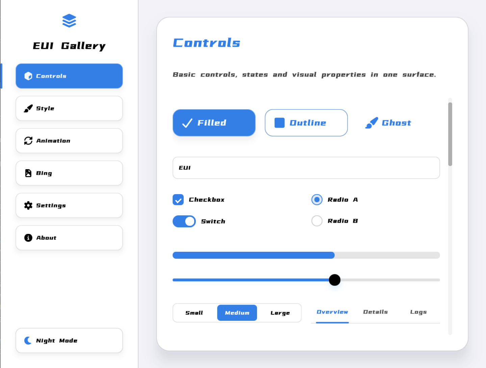
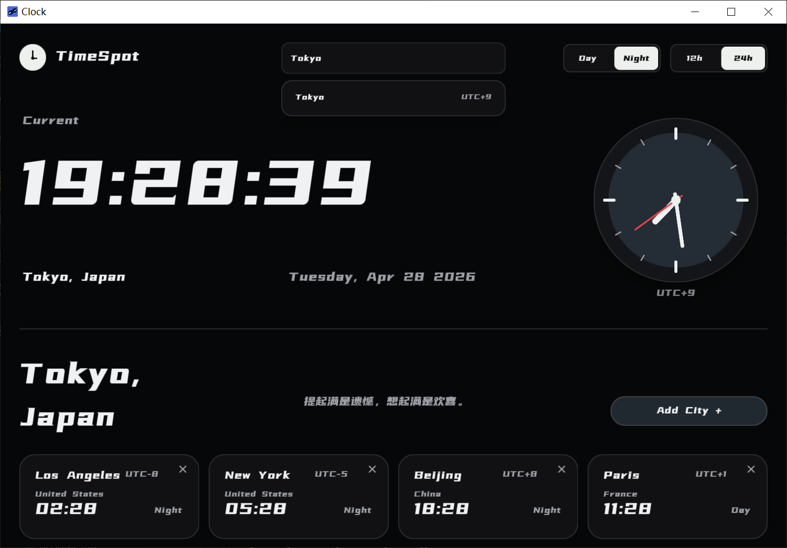

# EUI-NEO

  

  <a href="README.zh-CN.md">简体中文</a>

EUI-NEO is a declarative desktop UI system powered by C++17, OpenGL, and GLFW.
It turns interface structure, visual styling, interaction callbacks, animation targets,
and rendering state into one coherent DSL-driven model.

Official website and documentation:

- [EUI-NEO website](../eui-neo.html)
- [Documentation center](../eui-neo-docs.html)
- [GitHub repository](https://github.com/sudoevolve/EUI-NEO)

## Preview

|  |  |
| --- | --- |
|  |  |
|  |  |
|  |  |

## System Highlights

- Declarative DSL built around `Row`, `Column`, `Stack`, `Rect`, `Text`, `Image`, and `Polygon`.
- Runtime-owned layout, input, focus, scrolling, animation, dirty-region rendering, and framebuffer cache.
- Component language for controls, overlays, pickers, data tables, charts, and theme tokens.
- Target-state animation for frame, color, text color, opacity, radius, border, shadow, blur, and transform.
- Desktop graphics foundation using C++17, OpenGL, and GLFW.

## Documentation

Use the documentation page:

- [EUI-NEO Docs](../eui-neo-docs.html)

The `docs/` folder keeps the supporting technical notes used by the website package.
